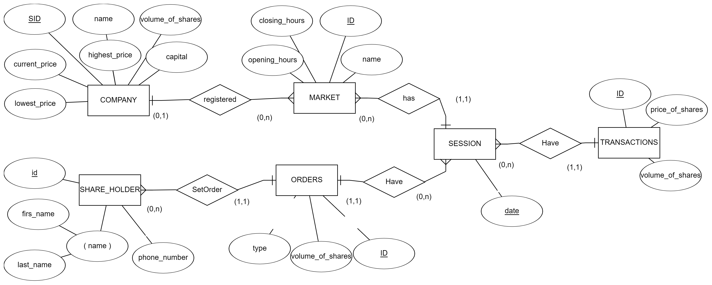
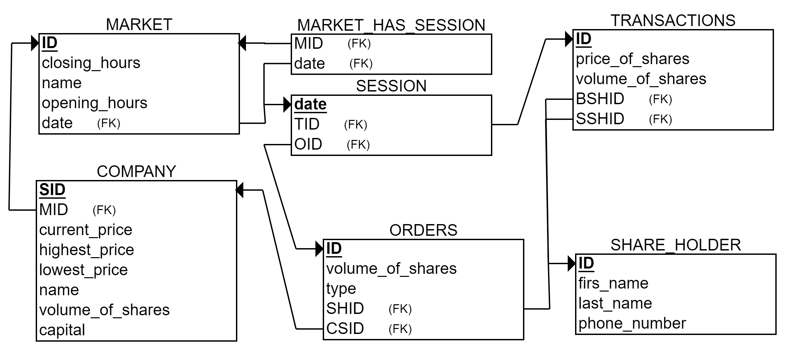

# Stock Exchange Database

### This technical report will tackle the development workflow of a database for a stock exchange online application where users will be able to trade shares of companies registered in a stock exchange market and their data will be stored & organized in an optimized mechanism.

 

### In this Repo:

<dd>➢ <a href="stock_exchangeERD.erdplus">Electronic version of ERD.</a></dd>
<dd>➢ <a href="stock_exchangeRS.erdplus">Electronic version of RS.</a></dd>
<dd>➢ <a href="tables_creation.sql">SQL to create the data base & its tables.</a></dd>
<dd>➢ <a href="data_insertion.sql">SQL to insert sample data.</a></dd>
<dd>➢ <a href="queries.sql">SQL queries to Fetch data in specific scenarios.</a></dd>

<!-- ///////////////////////////////////////////////////////////////////////////////////// -->

   

<!-- ///////////////////////////////////////////////////////////////////////////////////// -->

## Entity Relation Diagram

  

## Relational Schema

#### KEYWORDS

<table>
  <tr>
    <th>Acronym</th>
    <th>Description</th>
    <th></th>
    <th>Acronym</th>
    <th>Description</th>
  </tr>
  <tr>
    <td>STID</td>
    <td>session transaction id </td>
    <td></td>
    <td>BSHID</td>
    <td>buyer share holder id</td>
  </tr>
  <tr>
    <td>SSHID</td>
    <td>seller share holder id</td>
    <td></td>
    <td>CSID</td>
    <td>company share id</td>
  </tr>
  <tr>
    <td>SID</td>
    <td>session id</td>
    <td></td>
    <td>MID</td>
    <td>market id</td>
  </tr>
  
</table>

 
<!-- ///////////////////////////////////////////////////////////////////////////////////// -->

 

## Database design:

### The process starts with registering companies in a market, but we can’t store in the market table all companies ID’s registered in each market, hence in the company we store the market ID where it’s registered.

### Secondly, markets will open daily sessions, where shareholders can buy and sell shares. This requires creating a session table with a unique date attribute. But dates can’t be unique since multiple markets will open sessions on a daily basis, therefore the session table will only hold unique session’s date and a conjunction table was created where market’s ID and session’s unique date was stored as Foreign Keys.

### Through those sessions, shareholders can set orders where they buy or sell shares. Each two orders form a transaction.

 
<!-- ///////////////////////////////////////////////////////////////////////////////////// -->

 

## Cardinality Ratios:

 

### ❖ COMPANY registered in MARKET (N:1)

Many companies register in one market, and one market registers many companies.

### ❖ MARKET has SESSION (1:N)

A session can be created only by one market, but a market can create many sessions. (On a different day)

### ❖ SESSION have ORDERS (1:N)

One session has many orders, but an order can’t exist In multiple sessions.

### ❖ SHARE HOLDER sets ORDER (1:N)

One shareholder can set multiple orders, but an order can only be set by one shareholder.

### ❖ SESSION have TRANSACTIONS (1:N)

One session has many transactions, but a transaction doesn’t exist in multiple sessions.

 
<!-- ///////////////////////////////////////////////////////////////////////////////////// -->

 

## Normalization:

### ❖ To reach First Normalized Form:

➢	We split shareholder name into first_name & last_name to avoid having columns with composite value. 
➢	We Eliminated data redundancy.

### ❖ To reach Second Normalization Form:

➢	We prevented tables from having multiple primary keys, instead attributes in the tables are dependent on one primary key only.

### ❖ To reach Third Normalized Form:

➢	We prevented unrelated data from being stored together, instead we organized data and connected it through proper relations.

 
<!-- ///////////////////////////////////////////////////////////////////////////////////// -->

 

## SQL:

##### Note:

##### Any dates that happen to be Saturday OR Sunday cannot be inserted, therefore the insertion queries cannot be executed on Saturday, Sunday or Monday(Monday itself is an acceptable date in the database) because they contain functions that will insert the date of execution and the day before.

 

### Tables Constraints:

#### We used an UPDATE CASCADE for market id so that whenever a market id is changed in the market table all the children tables will inherit the update. In addition we used ON DELETE SET DEFAULT so that whenever a market is deleted the market id in the children tables is set to “NO MARKET” which is the default value.

#### When it comes to the other foreign keys we used ON DELETE SET NULL and ON UPDATE CASCADE so that the children tables will inherit the update.

#### But for the transactions table, we had two foreign keys that refer to the same primary key of which is the shareholder ID, therefore we were not able to apply ON UPDATE or ON DELETE constraints on both of them at the same time, and even though we were able to apply one of the constraints (either “on delete” or “on update”) we decided not to for the inconvenience of the result.

#### We implemented constraints on data so that no session dates will be accepted if the string value was either Saturday or Sunday. Hence there will be no orders or transactions on these dates.

#### In addition to that we restricted the value for order type to strictly be either “s” or “b” only.
